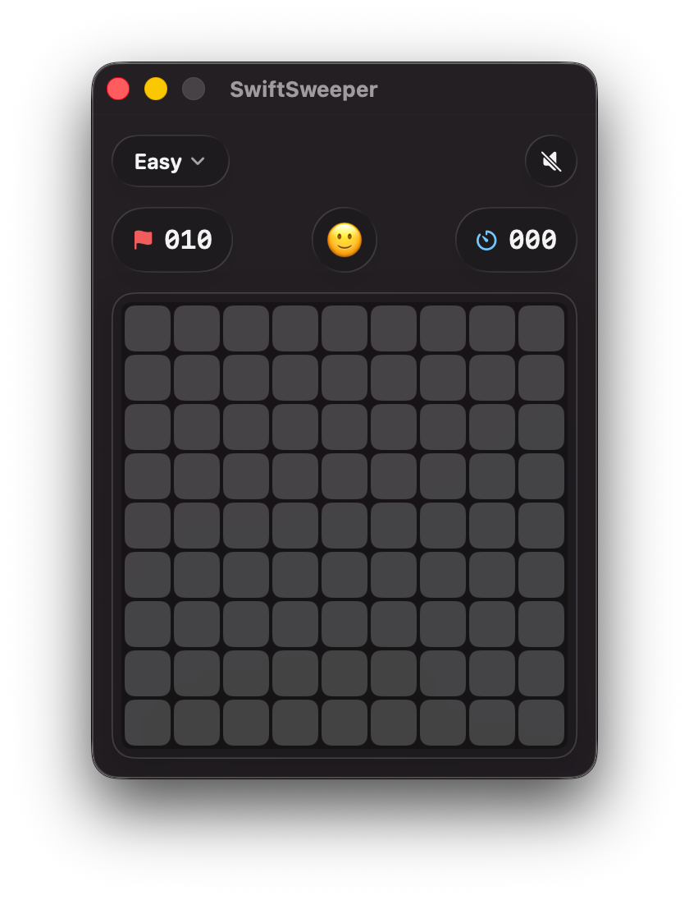

# SwiftSweeper

**The best Minesweeper on Mac.** Native SwiftUI, Liquid Glass, faithful to the original — no ads, no in-app purchases, no telemetry, no nonsense.

<p align="center">
  
</p>

## Why this is the best Minesweeper on Mac

- **Truly native.** Pure SwiftUI / AppKit. Boots instantly, lives in `/Applications`, gets a real menu bar with standard shortcuts. Not an Electron port, not a web wrapper, not a port of an iOS app stretched sideways.
- **Liquid Glass, done right.** The HUD, difficulty menu, mute toggle, and game-over card are all real Liquid Glass surfaces — and the win/loss card morphs into a top pill via a container-transform animation so you can see the final board.
- **Classic-faithful, pixel for pixel.** Number colors match the original Windows Minesweeper RGB values in light mode and preserve the same hue identities with lifted lightness in dark mode. Chord-click works exactly like it did in 1990.
- **Full keyboard play.** Arrow keys move a focus ring, Space reveals, F flags, Return chords, R starts a new game. No mouse required. The focus ring auto-hides the moment you touch the trackpad.
- **Mouse play that doesn't drop clicks.** Trackpad clicks are dispatched through an app-level `NSEvent` monitor to sidestep a SwiftUI/Liquid-Glass quirk where rapid clicks get silently swallowed. Every click counts.
- **Persistent stats.** Best time, total wins, total games, win rate — all saved via `@AppStorage`.
- **Accessible.** VoiceOver labels on the HUD, standard focus ring on controls.
- **Zero junk.** No ads. No IAP. No accounts. No network calls. Source is under 1,500 lines and fully unit-tested for the game-logic layer.

## Features

- **Difficulty:** Easy (9×9 / 10), Medium (13×13 / 25), Hard (16×16 / 45), and a Custom sheet for any board from 5×5 up to 30×30.
- **Chord-click.** Hold left + right on a revealed numbered cell whose flag count matches the number to reveal every non-flagged neighbor. Mis-flag and you lose, just like the original.
- **Game-over peek.** Win or lose, hit the chevron (or press `B`) to morph the result card into a small glass pill at the top — the board stays visible behind it. Tap the pill to expand the card back.
- **Standard macOS menu bar** with shortcuts for new game, difficulty, mute.
- **Sound.** Funk on win, Bottle on loss, gated by a mute toggle.

## Requirements

- macOS 26 (Tahoe) — uses Liquid Glass APIs
- Swift 6.2 toolchain (Xcode 27+ or Swift CLI)

## Install

```bash
git clone https://github.com/BenjaminHolderbein/swiftsweeper.git
cd swiftsweeper
make install        # builds, bundles, copies to /Applications
```

Then launch from Spotlight or `/Applications/SwiftSweeper.app`. To uninstall: `make uninstall`.

## Run from source

```bash
make                # build + launch (uses .build/debug/SwiftSweeper.app)
make test           # run the XCTest suite
make clean          # remove build artifacts
```

## Controls

### Mouse

| Action | Effect |
|---|---|
| Left-click cell | Reveal |
| Right-click cell | Cycle flag → question → blank |
| Left + right (held) on numbered cell | Chord |

### Keyboard

| Key | Effect |
|---|---|
| Arrow keys | Move focus ring |
| Space | Reveal focused cell |
| F | Flag focused cell |
| Return | Chord (or new game from the game-over screen) |
| R | New game |
| B | After game-over: toggle the result card between full card and top pill |

### Menu bar shortcuts

| Shortcut | Action |
|---|---|
| ⌘R | New game |
| ⌘M | Toggle mute |
| ⌘1 / ⌘2 / ⌘3 | Easy / Medium / Hard |
| ⌘0 | Open Custom board sheet |

## Project structure

```
Sources/
├── SwiftSweeperKit/        Pure game logic (testable, no UI)
│   ├── Cell.swift
│   └── GameViewModel.swift
└── SwiftSweeper/           macOS app
    ├── SwiftSweeper.swift  @main entry, AppDelegate, Game menu
    ├── ContentView.swift   Root view, HUD, persistence, keyboard
    ├── GlassCellView.swift Cell rendering + classic palette
    ├── GameOverView.swift  End-of-game card
    ├── CustomBoardSheet.swift
    ├── ClickDispatcher.swift  App-level NSEvent monitor (see notes)
    └── WindowReader.swift  Resolves the hosting NSWindow

Tests/SwiftSweeperKitTests/  20 XCTest cases
```

## Implementation notes

- The package is split into a library (`SwiftSweeperKit`) and an executable (`SwiftSweeper`) so the game logic is unit-testable without dragging SwiftUI/AppKit into tests.
- **`ClickDispatcher`** captures every left/right mouseDown at the app level via `NSEvent.addLocalMonitorForEvents`. It computes which cell was hit and dispatches directly to the view model. This works around a SwiftUI/Liquid-Glass event-delivery quirk where trackpad clicks with accumulating `clickCount` get silently dropped before reaching `NSHostingView.mouseDown`. Per-cell `RightClickableView` is gone — cells are visual only.
- Custom board dimensions persist via `@AppStorage`; the Custom sheet uses typeable text fields plus steppers with bounds clamped to a first-tap safe zone.

## Credits

Forked from [katistix/swiftsweeper](https://github.com/katistix/swiftsweeper). The fork lives at [BenjaminHolderbein/swiftsweeper](https://github.com/BenjaminHolderbein/swiftsweeper).
